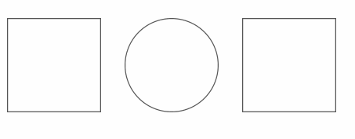

# SVG Progress Bar

<br>


<br>
Beautiful and responsive progress bars with animated SVG paths.
[Use built-in shapes](#circlecontainer-options) or [create your own paths](#pathpath-options).

# API

[**ProgressBar**](#api)


* [Circle(container, options)](#circlecontainer-options)
    * [animate(percent, options)](#circleanimatepercent-options)
    * [stop()](#circlestop)
    * [set(percent)](#circlesetpercent)


* [Square(container, options)](#squarecontainer-options)
    * [animate(percent, options)](#squareanimatepercent-options)
    * [stop()](#squarestop)
    * [set(percent)](#squaresetpercent)


* [Path(path, options)](#pathpath-options)
    * [animate(percent, options)](#pathanimatepercent-options)
    * [stop()](#pathstop)
    * [set(percent)](#pathsetpercent)


All built-in shapes are drawn on 100x100 square SVG canvas.
All shapes fill their canvases.

## Circle(container, options)

Circle shaped progress bar. Appends SVG to container.

**Example**

```javascript
var progressBar = new ProgressBar.Circle('#container', {
    strokeWidth: 2
});
```

To make circle resize with its container, set for example the following CSS:

```css
.container > svg {
    display: block;
    width: 100%;
}
```

**Parameters**

* `container` Element where SVG is added. Query string or element.

    For example `"#container"` or `document.getElementById("#container")`

* `options` Options for path drawing.

    ```javascript
    {
        // Stroke color.
        // Default: "#555"
        color: "#3a3a3a",

        // Width of the stroke.
        // Unit is percentage of SVG canvas.
        // Default: 0.5
        strokeWidth: 0.1,

        // Color for lighter trail stroke
        // underneath the actual progress path.
        // If null, trail path is not drawn
        // Default: "#f4f4f4"
        trailColor: "#f4f4f4",

        // Fill color for the shape. If undefined, no fill.
        // Default: undefined
        fill: "rgba(0, 0, 0, 0.5)",

        // Duration for animation in milliseconds
        // Default: 800
        duration: 1200,

        // Easing for animation. CSS3 easings are supported.
        // Default: "ease-in-out"
        easing: "linear"
    }
    ```

## Circle.animate(percent, options)

Animates drawing of circle.

**Example**

```javascript
progressBar.animate(30, {
    duration: 800
});
```

**Parameters**

* `percent` Percent from 0 to 100.
* `options` Animation options. These options override the defaults given in initialization.

    ```javascript
    {
        // Duration for animation in milliseconds
        // Default: 800
        duration: 1200,

        // Easing for animation. CSS3 easings are supported.
        // Default: "ease-in-out"
        easing: "linear"
    }
    ```

## Circle.set(percent)

Sets progress to a percent instantly without animation. Clears all transitions
for path.

## Circle.stop()

Stops animation to its current position.

<br>
<br>

## Square(container, options)

Square shaped progress bar. Appends SVG to container.

**Example**

```javascript
var progressBar = new ProgressBar.Square('#container', {
    strokeWidth: 2
});
```

To make square resize with its container, set for example the following CSS:

```css
.container > svg {
    display: block;
    width: 100%;
}
```

**Parameters**

* `container` Element where SVG is added. Query string or element.

    For example `"#container"` or `document.getElementById("#container")`

* `options` Options for path drawing.

    ```javascript
    {
        // Stroke color.
        // Default: "#555"
        color: "#3a3a3a",

        // Width of the stroke.
        // Unit is percentage of SVG canvas.
        // Default: 0.5
        strokeWidth: 0.1,

        // Color for lighter trail stroke
        // underneath the actual progress path.
        // If null, trail path is not drawn
        // Default: "#f4f4f4"
        trailColor: "#f4f4f4",

        // Fill color for the shape. If undefined, no fill.
        // Default: undefined
        fill: "rgba(0, 0, 0, 0.5)",

        // Duration for animation in milliseconds
        // Default: 800
        duration: 1200,

        // Easing for animation. CSS3 easings are supported.
        // Default: "ease-in-out"
        easing: "linear"
    }
    ```

## Square.animate(percent, options)

Animates drawing of square.

**Example**

```javascript
progressBar.animate(30, {
    duration: 800
});
```

**Parameters**

* `percent` Percent from 0 to 100.
* `options` Animation options. These options override the defaults given in initialization.

    ```javascript
    {
        // Duration for animation in milliseconds
        // Default: 800
        duration: 1200,

        // Easing for animation. CSS3 easings are supported.
        // Default: "ease-in-out"
        easing: "linear"
    }
    ```

## Square.set(percent)

Sets progress to a percent instantly without animation. Clears all transitions
for path.

## Square.stop()

Stops animation to its current position.

<br>
<br>

## Path(path, options)

Custom shaped progress bar. You can create arbitrary shaped progress bars by
passing a SVG path created with e.g. Adobe Illustrator. It's on caller's responsibility to append SVG to DOM.

**Example**

Assuming there was SVG object with heart shaped path in HTML

```html
<svg xmlns="http://www.w3.org/2000/svg" version="1.1" x="0px" y="0px" viewBox="0 0 100 100">
    <path fill-opacity="0" stroke-width="0.5" stroke="#f4f4f4" d="M81.495,13.923c-11.368-5.261-26.234-0.311-31.489,11.032C44.74,13.612,29.879,8.657,18.511,13.923  C6.402,19.539,0.613,33.883,10.175,50.804c6.792,12.04,18.826,21.111,39.831,37.379c20.993-16.268,33.033-25.344,39.819-37.379  C99.387,33.883,93.598,19.539,81.495,13.923z"/>
    <path id="heart-path" fill-opacity="0" stroke-width="0.6" stroke="#555" d="M81.495,13.923c-11.368-5.261-26.234-0.311-31.489,11.032C44.74,13.612,29.879,8.657,18.511,13.923  C6.402,19.539,0.613,33.883,10.175,50.804c6.792,12.04,18.826,21.111,39.831,37.379c20.993-16.268,33.033-25.344,39.819-37.379  C99.387,33.883,93.598,19.539,81.495,13.923z"/>
</svg>
```

Initialization would be this easy

```javascript
var svgPath = document.getElementById("#heart-path");
var path = new ProgressBar.Path(svgPath, {
    duration: 300
});
```

**Parameters**

* `path` [SVG Path](https://developer.mozilla.org/en-US/docs/Web/SVG/Tutorial/Paths) object. For example `$('svg > path:first-child')[0]`.
* `options` Animation options.

    ```javascript
    {
        // Duration for animation in milliseconds
        // Default: 800
        duration: 1200,

        // Easing for animation. CSS3 easings are supported.
        // Default: "ease-in-out"
        easing: "linear"
    }
    ```

## Path.animate(percent, options)

Animates drawing of path.

**Example**

```javascript
path.animate(30, {
    duration: 800
});
```

**Parameters**

* `percent` Percent from 0 to 100.
* `options` Animation options. These options override the defaults given in initialization.

    ```javascript
    {
        // Duration for animation in milliseconds
        // Default: 800
        duration: 1200,

        // Easing for animation. CSS3 easings are supported.
        // Default: "ease-in-out"
        easing: "linear"
    }
    ```

## Path.set(percent)

Set progress to a percent instantly without animation. Clears all transitions
for path.

## Path.stop()

Stops animation to its current position.
